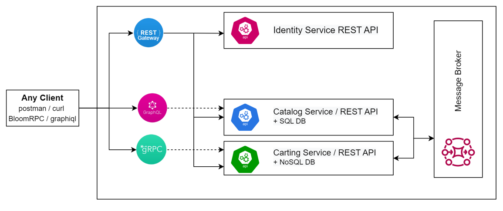

## Modules implementation order and dependencies
**Help module**\
    Gives high-level information about:
   - Program rules
   - Possible workflows
   - Participation responsibilities
   - Communication channels

**Required modules**\
    It is supposed to complete 1 by 1 as it can depend of each others results (all the modules should be completed)
   - Architectural styles and patterns - an exception module, not linked with others. The main idea is get to know architectures styles.
   - Layered architectures
   - REST API. Maturity model. Open API/Swagger
   - Message-Based architecture. Message broker
   - Security. Authentication & authorization
   - Code Quality. Metrics & Tools
   - Containerization and Orchestration

**Optional modules**\
   Can be processed in any order by mentee choice (not required for the sucessful completion)
   - API gateways
   - Advanced logging and tracing
   - GraphQL API
   - gRPC
   - CI/CD
   - SDLC. Estimations

**Possible outcome architecture**

