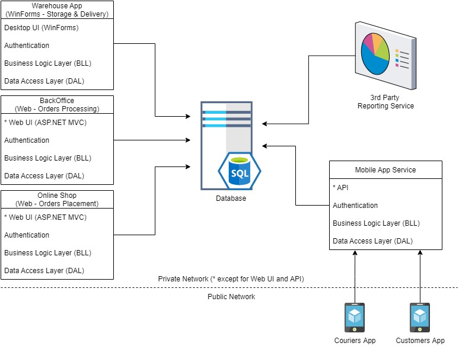

Your client is an online store with a warehouse and a delivery service. Solution components are the following:

- There is an MS SQL DATABASE on the server.
- Desktop application for the warehouse
- Web version for managers
- Web version for customers
- Mobile version for couriers
- Mobile version for customers
- There is also a third-party application for generating reports
    

All these applications are not connected to each other and work directly with database.

The architecture could be illustrated the following way:

Your client works in a single country but has plans to enter the markets in several other countries.

**Task 1**

Determine the architectural style of the solution. Provide an explanation for your choice.

**Task 2**

Draw the architectural diagram of the solution as if you were designing it from scratch. Provide pros and cons of the two solutions.

> **NB!** Scoreboard:

* 1-59 - The written answers to the ‘Self-check questions’ have been provided without significant issues.
* 60-89 ­­- Task 1 has been completed without significant issues.
* 90-100 - Task 2 has been completed without significant issues.

---

## Saved solution files

- Written answer: [03-hometask-solution.md](./03-hometask-solution.md)
- Diagram: [03-architecture-diagram.drawio](./images/03-architecture-diagram.drawio)
