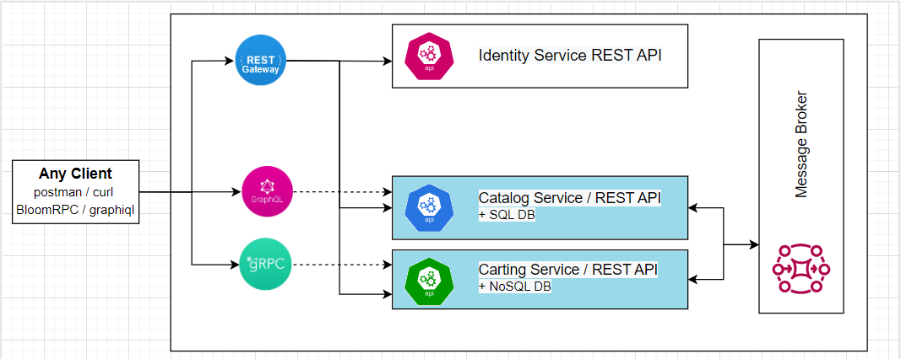

 The goal of this module is to provide an overview of the different layered architecture concepts from N-layer to Clean Architecture. Practical tasks include the implementation of the two services with the testability and extensibility as a non-functional requirement (NFR):
 - Catalog
 - Cart

 **Module outcome**

 BLL, DAL layers created for both services with covered NFRs

 