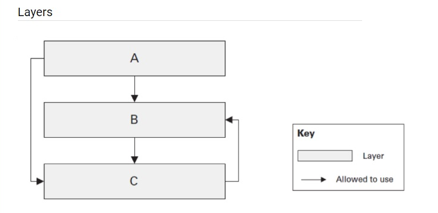

_Questions for the self-check:_

1. Name examples of the layered architecture. Do they differ or just extend each other?

   Layered architecture examples include classic N-tier architecture, presentation/application/domain/infrastructure layering, and Clean Architecture.

   They are related, but they are not the same. N-tier usually means a more physical separation of layers, while Clean Architecture is a stricter approach that extends the idea by enforcing dependency direction toward the center.

2. Is the below layered architecture correct and why? Is it possible from C to use B? from A to use C?
   

   The architecture is correct only if dependencies follow the intended direction of the layers. In a layered system, outer layers can use inner layers, but inner layers should not depend on outer layers.

   So, C can use B only if B is an inner layer for C. A should not use C if that breaks the dependency rule. If the diagram shows dependencies going upward or sideways in the wrong direction, then it is not a correct layered architecture.

3. Is DDD a type of layered architecture? What is Anemic model? Is it really an antipattern?

   DDD is not exactly a layered architecture, but it is often implemented inside one. DDD is a way to model software around the business domain, bounded contexts, and a shared domain language.

   An anemic model is a domain model that contains mostly data and very little behavior, while business logic is moved into services. It is often considered an antipattern because it weakens the domain model, but in very simple cases it may be acceptable if the cost of richer modeling is not justified.

4. What are architectural anti-patterns? Discuss at least three, think of any on your current or previous projects.

   Architectural anti-patterns are repeated design mistakes that make systems harder to understand, test, maintain, or scale.

   - Spaghetti code: logic is tangled with no clear boundaries, so changes become risky.
   - Big Ball of Mud: the system has no real structure, and everything depends on everything else.
   - God object or God service: one class or service does too many jobs and becomes difficult to change safely.

   On real projects, these often appear when business logic is duplicated in controllers, persistence leaks into the UI, or one service starts collecting too many responsibilities.

5. What do Testability, Extensibility and Scalability NFRs mean. How would you ensure you reached them? Does Clean Architecture cover these NFRs?

   Testability means the system can be verified with automated tests. Extensibility means new behavior can be added with limited changes. Scalability means the system can handle growth in users, data, or workload.

   I would ensure them by separating concerns, depending on abstractions, keeping business rules independent from infrastructure, and writing unit and integration tests. Clean Architecture strongly supports testability and extensibility because it isolates the domain and application layers from frameworks and infrastructure.

   Clean Architecture does not automatically guarantee scalability. Scalability also depends on deployment choices, database design, caching, message queues, and operational decisions.
