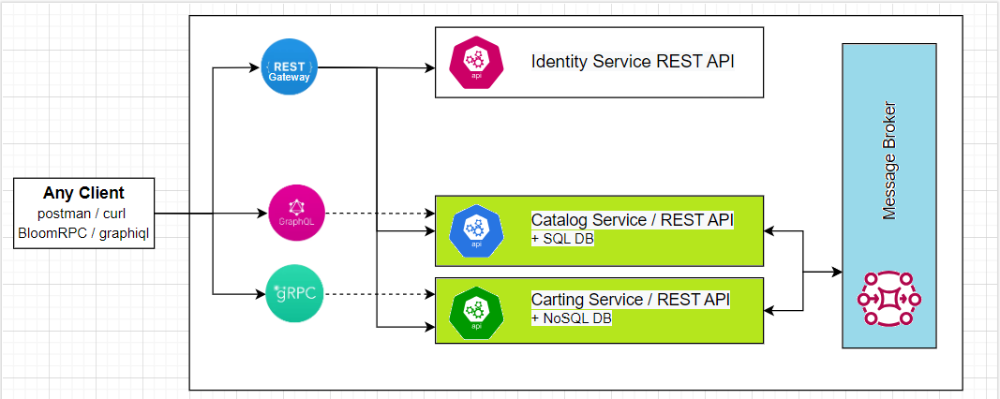

 The goal of the course is to provide an overview of Message-Based Architecture and its key concept - Message Brokers (also called Message Oriented Middleware). Practical tasks include setting up one of the Message Broker tools and implementing Catalog and Cart services interaction using the selected message broker.

 **Module outcome**

 Implement the interaction between Catalog and Cart services via a message broker with covered NFRs

 