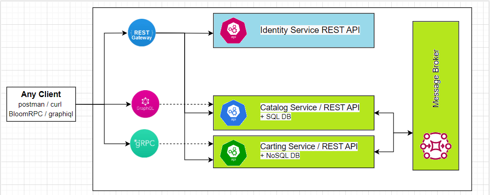

 Authentication and authorization are essential aspects of any modern application/ service or subsystem. In this module we will review different auth options and protocols as well as advanced concepts like SSO and MFA (Multi Factor Authentication). The practical part includes setup and configuration of your IAM (Identity and Access Management) server and role-based authentication implementation for your Catalog service.

 **Module outcome**

 Implement role-based security for your Catalog service endpoints using JWT tokens

 