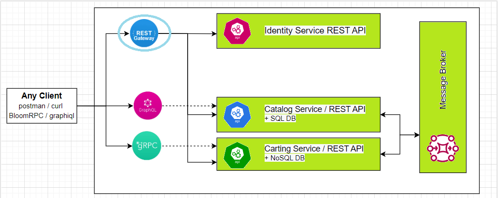

 The goal for this module is to become familiar with API Gateway concepts and its goals, it will also overview the Backends for Frontends pattern. Practical task includes the implementation of the API Gateway for both Catalog and Cart service.

 **Module outcome**

 Create API Gateway which combines both **Catalog & Cart Service** API endpoints so clients can query everything from a single endpoint

 