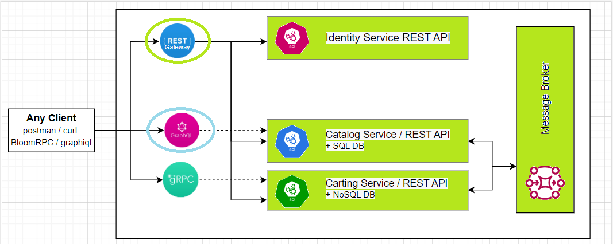

  The goal of this module is to provide an overview of GraphQL-based APIs, their benefits, and drawbacks in comparison with REST and RPC, as well as best practices for building GraphQL APIs. Practical task includes implementation of the GraphQL APIs for Catalog service.

 **Module outcome**

 Create GraphQL based WEB API for **Catalog Service**

 