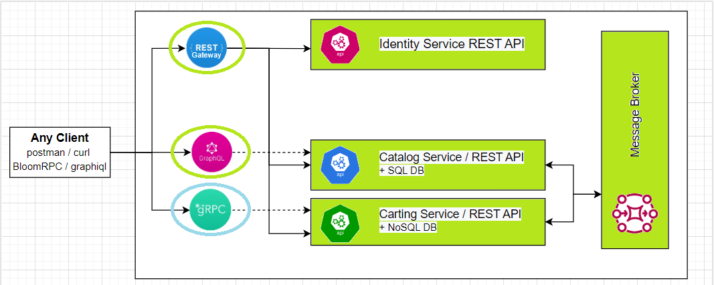

 The goal of this module is to provide an overview of an RPC (Remote Procedure Call) approach and its advanced topics like Protocol Buffers, Streaming, Deadlines/Cancellation, Authentication, Benchmarks, Testing and Best Practices.

 **Module outcome**

 Create gRPC service based on **Cart Service**

 