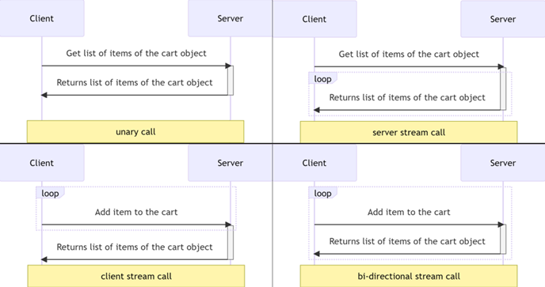
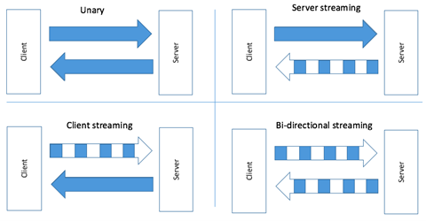

_Please, complete the following task:_ 

Description: Create gRPC service based on Cart Service

**Functional requirements:**
1. gRPC service should support following actions:
2. Get list of items of the cart object – unary rpc call
3. Get list of items of the cart object – server stream rpc call
4. Add item to the cart and return updated cart object – client stream rpc call
5. Add item to the cart and return updated cart object – bi-directional rpc call
    

**Nonfunctional requirements:**

1. Handle cancellation (context.CancellationToken)
2. Use logger to log information for better understanding
    

Notes: Use BloomRPC, it is an RPC client with an interface which will help you to test and demonstrate your work much more easily.

> **NB!** Scoreboard:

* 1-79 - A mentee can lead a discussion on the “Questions to Discuss” topics.
* 80-100 - Task has been completed.